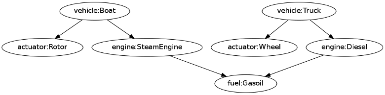
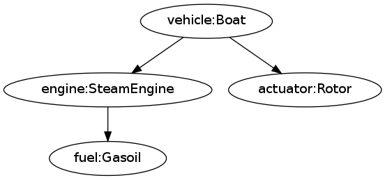
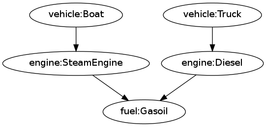
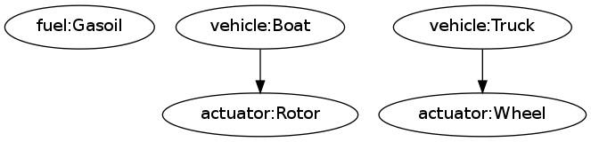

# Легковесный Dependency Injection

.fx: centered

## Легковесный Dependency Injection

Алексей Пирогов ([@alex_pir](), "БАРС Груп")

**"PiterPy-2015"**

---
# DI

**DI** - реализация IoC для библиотек

- берет на себя **поиск и импорт** модулей/сервисов
- обеспечивает *Dependency Inversion Principle* - **слабую связанность**
- обеспечивает прозрачную взаимозаменяемость модулей

---
# Концепция

- Service -> Client
- сервис создается, как *часть состояния* клиента
- сервис предоставляется клиенту *извне*!
- создание зависимостей *отделено* от создания объекта
- в отличие от *service locator* клиенту не нужно знать
о существовании и устройстве системы

---
# Преимущества

- DI можно сравнительно легко применить к *существующему коду*
- высокая степень *изоляции* увеличивает
    - тестируемость
    - сопровождаемость
    - пригодность к переиспользованию
- вынос конфигурации из кода в конфигурационные файлы
- упрощение коллективной разработки

---
# Недостатки

- потенциальное усложнение *понимания* кода - нужно просматривать больше файлов
- уменьшение степени *инкапсуляции* - зависимости становятся явными

---
# Виды DI

- **constructor** injection
- **setter** injection
- **interface** injection

---
# Примеры

---
# Код **без использования DI**

    :::python hl_lines="5"
    class Dependency:
        ...
    class Client:
        def __init__(self):
            self._dep = Dependency(...)
            ...
        def do_thing(self):
            self._dep.populate()

---
# **Constructor** injection

    :::python hl_lines="4 11"
    class Dependency:
        ...
    class Client:
        def __init__(self, dep):
            self._dep = dep
            ...
    # где-то в инжекторе(контейнере)
    def get_client(...):
        ...
        dep = Dependency(...)
        return Client(dep=dep)

---
# **Setter** injection

    :::python hl_lines="2 12"
    class Client:
        def set_dep(self, dep):
            self._dep = dep
        ...
    class Dependency:
        ...
    # где-то в инжекторе(контейнере)
    def get_client(...):
        ...
        dep = Dependency(...)
        client = Client()
        client.set_dep(dep)
        return client

---
# **Interface** injection

    :::python hl_lines="2 6 14"
    class Client:
        def set_dep(self, dep):
            self._dep = dep
        ...
    class Dependency:
        def inject(self, client):
            client.set_dep(self)
        ...
    # где-то в инжекторе(контейнере)
    def get_client(...):
        ...
        dep = Dependency(...)
        client = Client()
        dep.inject(client)
        return client

---
# Существующие реализации

---
# dependency_injection

    :::python hl_lines="8 11"
    def foo(bar, baz):
        return bar + baz

    def inject_dependencies(func):
        my_state = {
            'bar': 1, 'baz': 2, 'bloo': 'blee'
        }
        dependencies = resolve_dependencies(
            func, my_state
        )
        return func(*dependencies.as_args)

---
# zuice

    :::python hl_lines="4 8 14"
    import zuice

    class BlogPostLister(zuice.Base):
        _fetcher = zuice.dependency(
            BlogPostFetcher)

    bindings = zuice.Bindings()
    bindings.bind(
        BlogPostFetcher
    ).to_instance(
        BlogPostFetcher())
    ...
    injector = zuice.Injector(bindings)
    injector.get(BlogPostLister)

---
# Injector

    :::python hl_lines="4 10 13"
    from injector import Injector, inject, Key
    GreetingType = Key('GreetingType')

    @inject(greeting_type=GreetingType)
    def greet(greeting_type, who):
        print('%s, %s'
              % (greeting_type, who))

    def configure(binder):
        binder.bind(GreetingType, to='Hello')

    >>> injector = Injector(configure)
    >>> greet_wrapper = injector.get(greet)
    >>> greet_wrapper(who='John')
    Hello, John

---
# pinject

    :::python hl_lines="3 5"
    >>> class OuterClass(object):
    ...     def __init__(self, inner_class):
    ...         self.inner_class = inner_class
    ...
    >>> class InnerClass(object):
    ...     def __init__(self):
    ...         self.forty_two = 42
    ...
    >>> obj_graph = pinject.new_object_graph()
    >>> outer_class = obj_graph.provide(OuterClass)
    >>> print outer_class.inner_class.forty_two
    42

---
# pinject

    :::python hl_lines="3 9 13"
    >>> class SomeClass(object):
    ...     def __init__(self, long_name):
    ...         self.long_name = long_name
    >>> class LongName(object):
    ...     def __init__(self):
    ...         self.foo = 'foo'
    >>> class MyBindingSpec(pinject.BindingSpec):
    ...     def configure(self, bind):
    ...         bind('long_name', to_class=LongName)
    ...
    >>> obj_graph = pinject.new_object_graph(
    ...     binding_specs=[MyBindingSpec()])
    >>> some_class = obj_graph.provide(SomeClass)
    >>> print some_class.long_name.foo
    'foo'

---
# YADIC

---
# yadic

**Y**et **A**nother **D**ependency **I**njection **C**ontainer

- **constructor** injection
- конфигурация - словарь (JSON, YAML...)
- можно писать, не пользуясь декораторами, метаклассами и проч

---
# Примеры

---
# Конфигурируемый код

    :::python
    class Vehicle:   # boat, truck...
        def __init__(self, engine, actuator):
    ...
    class Engine:    # steam, diesel...
        def __init__(self, fuel):
    ...
    class Fuel:      # coal, gasoil...
    ...
    class Actuator:  # rotor, wheels...
    ...

---
# Типичная конфигурация

    :::yaml hl_lines="2 3"
    vehicle:
      __default__:
        __realization__: 'domain.Vehicle'
      Boat:
        engine: SteamEngine
        actuator: Rotor

    engine:
      SteamEngine:
        __realization__: 'domain.engines.SteamEngine'
        fuel: Coal

    fuel:
      Coal:
        __realization__: 'domain.fuel.Coal'

---
# Использование

    :::python
    from yadic.container import Container

    container = Container(
        json.load(open('config.json')))

    controller = container.get('vehicle', 'Boat')

---
# Вариации

    :::yaml hl_lines="4 8 13 15 16"
    const:
      pi:
        __realization__: 'constants.PI'
        __type__: static

      someSum:
        __realization__: 'funcs.add'
        $x: 10
        $y: 32

    model:
      User:
        'profile:model': Profile
        'relations:model':
          - Avatar
          - History

---
# Вариации

    :::yaml hl_lines="7"
    model:
      User:
        db_connection: Main

    db_connection:
      Main:
        __type__: singleton
        $connection_string: "http://localhost:1234"

---
# Визуализация

---
# Пример

``vehicles.json``:

    :::json
    {"vehicle": {"Boat": {"engine": "SteamEngine",
                          "actuator": "Rotor"},
                 "Truck": {"engine": "Diesel",
                           "actuator": "Wheel"}},

    "engine": {"SteamEngine": {"fuel": "Gasoil"},
               "Diesel": {"fuel": "Gasoil"}},

    "actuator": {"Wheel": {},
                 "Rotor": {}},

    "fuel": {"Gasoil": {}}}

---
# **dot**-файл

    :::shell hl_lines="1"
    $ python -m yadic.dot vehicles.json
    digraph container {
	    "engine:SteamEngine" -> "fuel:Gasoil";
	    "engine:Diesel" -> "fuel:Gasoil";
        "vehicle:Truck" -> "engine:Diesel";
	    "vehicle:Truck" -> "actuator:Wheel";
        "vehicle:Boat" -> "engine:SteamEngine";
        "vehicle:Boat" -> "actuator:Rotor";
    }

---
# Рендеринг (GraphViz)

    :::shell hl_lines="2"
    $ python -m yadic.dot vehicles.json \
    | dot -Tpng > vehicles.png

---
# Выборочное отображение

    :::shell hl_lines="2"
    $ python -m yadic.dot vehicles.json \
    --include="vehicle:Boat"            \
    | dot -Tpng > vehicles.png

---
# Выборочное отображение

    :::shell hl_lines="2"
    $ python -m yadic.dot vehicles.json \
    --exclude="actuator"                \
    | dot -Tpng > vehicles.png

---
# Выборочное отображение

    :::shell hl_lines="2 3"
    $ python -m yadic.dot vehicles.json \
    --include="vehicle;fuel"            \
    --exclude="engine"                  \
    | dot -Tpng > vehicles.png

---
# Ссылки

**yadic**:

- [PyPI](https://pypi.python.org/pypi/yadic)&nbsp;/&nbsp;[Bitbucket](https://bitbucket.org/astynax/yadic)

Упомянутые в презентации библиотеки для DI

- [dependency_injection](https://pypi.python.org/pypi/dependency_injection)
- [zuice](https://pypi.python.org/pypi/zuice)
- [Inject](https://pypi.python.org/pypi/Inject)
- [pinject](https://pypi.python.org/pypi/pinject)

---
# Вопросы

---
# Спасибо за внимание!
